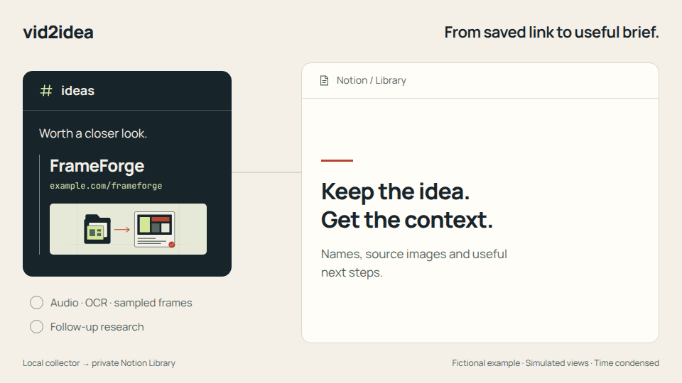
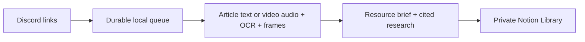

# vid2idea

**Save a link in Discord. Come back to an illustrated, researched brief in Notion.**

[](https://github.com/cjcsecurity/vid2idea/actions/workflows/ci.yml)
[](https://github.com/cjcsecurity/vid2idea/actions/workflows/security.yml)
[](LICENSE)

Your saved links are full of projects worth trying. Finding them again—and remembering why you saved them—is the hard part.

vid2idea is an open-source collector that runs on your computer. Drop a video or article into a Discord ideas channel, and it identifies the resources featured in the source, gathers useful details, and publishes a brief to your private Notion Library. Names shown only on screen can be recovered through frame OCR and vision.

<a href="docs/demo.md">
  <picture>
    <source media="(max-width: 600px)" srcset="docs/assets/vid2idea-mobile.svg">
    <source media="(prefers-reduced-motion: reduce)" srcset="docs/assets/vid2idea-poster.jpg">
    
  </picture>
</a>

[Watch the demo](docs/demo.md) · [Static preview](docs/assets/vid2idea-poster.jpg) · [Read a sample brief](examples/brief.md) · [Get started](#get-started)

*The demo uses fictional example content and simulated views. Processing is condensed for the walkthrough.*

> **Alpha:** built for a personal ideas channel. Linux/WSL2 is supported; setup requires your own Discord bot and Notion databases. Your computer must be awake to ingest links. Finished briefs remain readable in Notion while it is off.

## From “save this” to “try this”

1. **Share a source.** Post a public video or article link in your channel. Add a note beside it if you have a particular question or use in mind.
2. **Recover the useful parts.** The collector reads article text or combines video transcription, on-screen text and sampled frames. It creates a structured brief and researches eligible follow-up questions.
3. **Revisit it in Notion.** Open the resource links, compare use cases, mark a favorite, add your own notes, or move an idea from Saved to Trying.

### What you get in a brief

| Start with | Then explore |
| --- | --- |
| **Resource names and direct links** | Individual summaries of the projects, websites or articles featured in the source |
| **Source images** | Up to three images with captions and available video timestamps |
| **Practical applications** | General use cases and optional suggestions for your local or GitHub projects |
| **Suggested first steps** | Small ways to evaluate or try the idea |
| **Follow-up research** | Answers with successfully opened sources and checked dates |
| **Coverage notes** | Missing evidence, access restrictions and questions that still need your input |

Refreshing a brief preserves your notes, favorites, stages, review status and edited project relations. The collector updates its own generated section and leaves unrelated page content in place.

## Get started

Choose **manual setup** below, or open this repository in your coding assistant and use this prompt:

> Read AGENTS.md, README.md and docs/setup.md. Help me install vid2idea, choose an AI provider, and configure my Discord channel and private Notion Library. Keep tokens out of chat, preserve existing configuration, and verify setup before starting ingestion.

Codex, Claude Code and Gemini CLI share the same project instructions. Other terminal-capable assistants can read `AGENTS.md` directly. The coding assistant you use for setup can differ from the runtime AI provider.

You will need:

- **Linux or WSL2 and Python 3.12.** Native Windows and macOS are unsupported in this alpha.
- [uv](https://docs.astral.sh/uv/getting-started/installation/), Git and Node.js. The release was tested with **Node.js 24 and Codex CLI 0.160.0**.
- [FFmpeg](https://ffmpeg.org/download.html), with both `ffmpeg` and `ffprobe` on PATH. On Ubuntu: `sudo apt install ffmpeg`.
- A Discord server where you can add a bot, and a Notion workspace where you can create an internal connection and the required databases.
- One AI provider: Codex (default), Claude Code, Gemini CLI, or an OpenAI-compatible endpoint. See the [provider guide and verification matrix](docs/providers.md).

### 1. Install and sign in

```bash
git clone https://github.com/cjcsecurity/vid2idea.git
cd vid2idea
uv sync --directory collector --extra media --locked
npm install -g @openai/codex@0.160.0
codex login
```

The commands above use the default Codex provider. For Claude or Gemini, replace the Codex installation/login steps with the [provider guide](docs/providers.md).

Choose **ChatGPT authentication** for Codex. The default workflow uses your Codex subscription; its access and usage limits apply. No separate AI API key is required. See the [official Codex CLI documentation](https://developers.openai.com/codex/cli).

### 2. Connect Discord and Notion

```bash
cd collector
uv run --locked --extra media vid2idea init
```

This creates a private `.env` and refuses to overwrite an existing file. Follow the [setup guide](docs/setup.md) to invite your Discord bot, grant the Notion connection access, and create the exact Library schema. Edit `.env` locally; keep tokens out of commits and issues.

After adding your Notion token and granting access, find your data source IDs:

```bash
uv run --locked --extra media vid2idea notion-sources
```

The command lists accessible source names and IDs without printing your token.

### 3. Check and collect

```bash
uv run --locked --extra media vid2idea doctor --check-ai --check-notion
uv run --locked --extra media vid2idea run
```

Doctor checks configuration, the selected provider, media prerequisites and the Notion destination. `--check-ai` uses quota for one fictional brief and publishes nothing; it does not test research or video extraction. Post one short public source and inspect the resulting page before [setting up autostart](docs/operations.md).

**Existing channel?** The collector automatically catches up from accessible history. Use a dedicated channel if you want to start with new ideas. Leave `DISCORD_AUTHOR_ID` empty for all non-bot posts, or set it to collect only one person's links.

Run `uv run --locked --extra media vid2idea status` to inspect the queue while collection continues. Commands above run from `collector/`; from another folder, pass `--env-file /absolute/path/to/collector/.env`. Relative data paths follow that file's folder. Keep `.env` owned by you with mode `600`.

## Make the suggestions yours

Personalization is optional. Leave these settings blank to get general use cases:

| Setting | Context it supplies |
| --- | --- |
| `BRIEF_CONTEXT` | Your interests or the kinds of ideas you want to explore |
| `PROJECT_ROOTS` | Colon-separated parent folders containing local projects |
| `GITHUB_OWNER` | Your GitHub account; discovery uses the official `gh` CLI after `gh auth login` |

The collector reads bounded README/package descriptions and repository metadata. These summaries go to your configured AI provider. A brief can suggest how a newly discovered tool might fit an opted-in project; proposed integrations are kept distinct from features established by the source.

See [security and privacy](SECURITY.md) for what leaves your computer and what is stored in Notion.

## How it works



The collector is a local Python process with a SQLite outbox and one processing worker. Discord capture continues while a source is being processed, so a burst of links can wait in the queue.

Three design choices shape the implementation:

- **Keep source evidence visible.** Transcription, OCR and frames support resource identification; coverage gaps remain in the brief.
- **Recover without repeating expensive work.** Stable source identities, generated snapshots, image upload IDs and publication journals support retries and reconciliation.
- **Respect the reader's edits.** Generated content has a managed section; personal fields and unrelated blocks remain under your control.

[Architecture and module map](docs/architecture.md) · [Operations and recovery](docs/operations.md) · [Release verification](docs/release-verification.md)

## Limits and common questions

**Can it read every video or article?** Public TikTok, Instagram and YouTube access varies. Private, removed or restricted links can produce blocked or partial entries. The collector does not import browser cookies or sign into social accounts. Articles that require browser rendering may be unavailable.

**Can it read Instagram slideshows?** Yes: single-photo posts and carousels with up to 20 photo/video slides. It preserves slide order and the creator caption, reads photo text, and transcribes/samples video slides. Limits include 4 MiB and 16 million pixels per photo, 10 minutes of combined video, and the existing 200 MiB/15-minute job budget. Up to 12 images go to visual analysis and three distinct slides illustrate the article. Unreadable slides are marked as gaps. Use **Refresh article** in Notion to retry a previously blocked post.

**Will it catch everything shown on screen?** Videos are limited to 10 minutes and 200 MiB, using self-contained MP4/MOV/WebM processing. OCR samples up to 90 frames per video; vision receives up to 12. Briefly displayed details can be missed. Local transcription defaults to Whisper `small` on CPU and downloads a model on first use; `WHISPER_MODEL=tiny` reduces resource needs. Each job has a 15-minute deadline, including bounded research.

**What does it cost to run?** There is no hosted website or cloud database to deploy. You supply your computer, Discord bot, Notion workspace and AI access. Your selected AI provider’s usage limits and Notion plan limits apply. Local transcription and OCR use your computer's resources.

**Can I use Claude, Gemini, or a local model?** Yes. Select `codex`, `claude`, `gemini`, or `openai` in `AI_PROVIDER`. CLI providers support generation and research; the API-compatible path supports brief generation only. Claude/Gemini adapters are experimental: their pinned CLI contracts and offline regressions are checked, but authenticated end-to-end validation is still needed. See [provider setup](docs/providers.md).

**How much should I trust a brief?** Opened citations provide provenance, not a guarantee that every claim is correct. Review the source, coverage notes and unresolved questions before acting on a suggestion. This alpha is intended for a personal channel; see [security and privacy](SECURITY.md).

## Contribute

Useful contributions include source-extraction fixes, better resource identification, recovery improvements and clearer onboarding. Start with the [contribution guide](CONTRIBUTING.md) and use synthetic data for examples and tests. Run these commands from the repository root:

```bash
uv sync --directory collector --extra media --locked
uv run --directory collector --extra media --locked pytest tests -q
uv build --directory collector
```

[Report a bug](https://github.com/cjcsecurity/vid2idea/issues/new/choose) · [Report a security issue privately](https://github.com/cjcsecurity/vid2idea/security/advisories/new) · [Related projects](docs/competition-2026-10-05.md) · [How the demo was made](docs/media/README.md)

vid2idea is [MIT licensed](LICENSE). Dependencies and ingested material retain their own licenses.
