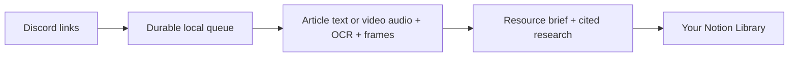

# vid2idea

**Turn the links you save in Discord into illustrated, researched briefs in Notion.**

Drop a public video or article into an ideas channel. A collector on your computer identifies the featured projects and websites, explains what they do, suggests ways to use them, and publishes a brief into your own Notion Library. Audio transcription and frame OCR help catch names the creator only shows on screen.



## What you get

- Featured resource names, grounded links, and individual summaries at the start of each brief.
- Up to three source images, useful details, first steps, and general applications.
- Optional suggestions informed by your local project READMEs and GitHub repositories.
- Follow-up research with opened source links, checked dates, and unresolved questions kept visible.
- History catch-up, duplicate detection, retryable jobs, and local article/image snapshots.
- Notion favorites, personal notes, stages, topics, and project relations. Refreshes preserve these fields and content outside the collector's managed section.

See an [illustrative brief](examples/brief.md), the [architecture](docs/architecture.md), and the [comparison with related projects](docs/competition-2026-10-05.md). This is an early release of a working personal workflow. First-time setup requires a Discord bot and a Notion database schema.

## Quick start

Supported and tested: **Linux or WSL2, Python 3.12, Node.js 24, FFmpeg/FFprobe, and Codex CLI 0.160.0**. Other Codex versions and macOS have not been verified. Native Windows is unsupported; use WSL2. Install [uv](https://docs.astral.sh/uv/getting-started/installation/) and [FFmpeg](https://ffmpeg.org/download.html), and put both `ffmpeg` and `ffprobe` on your PATH.

1. Download or clone this source into a folder named `vid2idea`.
2. Install the tested Codex CLI and sign in with ChatGPT:

   ```bash
   npm install -g @openai/codex@0.160.0
   codex login
   codex login status
   ```

   The default provider uses your normal Codex login. Subscription access and usage limits apply; this is not unlimited AI. See [official Codex CLI documentation](https://developers.openai.com/codex/cli). Setting `AI_PROVIDER=openai` supports an OpenAI-compatible API for brief generation, but disables automatic follow-up research. Use `AI_PROVIDER=codex` for the complete generation and research workflow.

3. From the repository root, install the locked Python dependencies:

   ```bash
   uv sync --directory collector --extra media --locked
   cp collector/.env.example collector/.env
   chmod 600 collector/.env
   ```

4. Follow [Discord and Notion setup](docs/setup.md), then fill in `collector/.env`. All destination IDs in the example are blank: use your own workspace and channel. Keep tokens out of chat, issues, and commits.
5. Start from the collector directory:

   ```bash
   cd collector
   uv run --locked --extra media vid2idea doctor --check-notion
   uv run --locked --extra media vid2idea import-history
   uv run --locked --extra media vid2idea run
   ```

Post one short public video or article. Check its Notion page, resource links, source images, coverage notes, and suggested uses. `status` shows the local queue without disturbing active jobs.

## Optional personalization

Set `PROJECT_ROOTS` to colon-separated parent folders, `GITHUB_OWNER` to your GitHub account, and/or `BRIEF_CONTEXT` to interests. GitHub access uses the official `gh` CLI: run `gh auth login` first. The reader uses bounded README/package descriptions and repository metadata, not source trees or `.env` files. These summaries are sent to the configured AI provider. Leave these settings blank for general suggestions.

## What to expect

Your computer needs to be awake for collection and processing. Notion remains readable while it is off; the collector catches up from Discord history when it returns. [Autostart, refresh and recovery](docs/operations.md) explain unattended operation.

Public TikTok, Instagram and YouTube access varies by platform and source. The collector does not log into social accounts or import browser cookies. Private, removed, unsupported or restricted sources can produce blocked or partial entries rather than complete briefs. Articles that require browser rendering may also be unavailable.

Videos are limited to 10 minutes and 200 MiB. OCR samples up to 90 frames; vision receives up to 12 frames. A source may show something between sampled frames. Local transcription defaults to the Whisper `small` model on CPU; the first use downloads it. `WHISPER_MODEL=tiny` reduces resource needs. A job has a 15-minute deadline, including a bounded research pass. AI-generated suggestions and research still need judgment; coverage and unresolved questions are shown explicitly.

## Development

```bash
uv sync --directory collector --extra media --locked
uv run --directory collector --extra media --locked pytest tests -q
uv build --directory collector
```

The regression suite uses synthetic data and mocked external services. Two legacy live Supabase checks are skipped by default; never enable them against a personal production service. Compatibility modules and their SDK remain for old-format migration, but the documented/default publishing backend is Notion. No Supabase or Vercel project is required.

See [CONTRIBUTING.md](CONTRIBUTING.md) and [SECURITY.md](SECURITY.md). Project source is [MIT licensed](LICENSE); dependencies and source material retain their own licenses.
