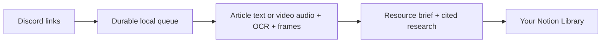

# vid2idea

[](https://github.com/cjcsecurity/vid2idea/actions/workflows/ci.yml)
[](https://github.com/cjcsecurity/vid2idea/actions/workflows/security.yml)
[](LICENSE)

**Save a link in Discord. Revisit an illustrated, researched brief in Notion.**

Interesting projects disappear into your saved links. vid2idea runs on your computer, watches an ideas channel, identifies the projects and websites featured in each source, and turns them into useful briefs in your private Notion Library. Transcription, frame OCR and vision help catch names a creator only shows on screen.



## Inside a brief

- Featured resource **names, links and individual summaries** first.
- Up to three source images, useful details and suggested first steps.
- General use cases, plus optional suggestions for your local and GitHub projects.
- Follow-up answers with opened sources and checked dates.
- Visible coverage gaps and questions that still need your input.

Notion keeps your favorites, personal notes, stages and project relations. Refreshing a brief preserves those fields and content outside the collector's managed section. History catch-up and a durable local queue keep a burst of links from getting lost.

[Read a sample brief](examples/brief.md) · [Setup guide](docs/setup.md) · [Operations and recovery](docs/operations.md)

**v0.1.0 is an alpha for a personal channel.** Setup requires your own Discord bot and a Notion Library schema. No hosted website, Vercel or Supabase project is needed. Your computer must be awake to ingest links; saved Notion pages remain readable while it is off.

## Get started

Tested: **Linux/WSL2, Python 3.12, Node.js 24 and Codex CLI 0.160.0**. Native Windows and macOS are unsupported in this release. Install [uv](https://docs.astral.sh/uv/getting-started/installation/), Git, Node.js, and [FFmpeg](https://ffmpeg.org/download.html). Both `ffmpeg` and `ffprobe` must be on PATH. On Ubuntu, FFmpeg is available through `sudo apt install ffmpeg`.

### 1. Install and sign in

```bash
git clone https://github.com/cjcsecurity/vid2idea.git
cd vid2idea
uv sync --directory collector --extra media --locked
npm install -g @openai/codex@0.160.0
codex login
```

Choose **ChatGPT authentication** for Codex. The default workflow uses your Codex subscription; its access and usage limits apply. It does not require a separately paid AI API. See [official Codex CLI documentation](https://developers.openai.com/codex/cli).

### 2. Connect your channel and Library

```bash
cd collector
uv run --locked --extra media vid2idea init
```

This creates a private `.env` without overwriting an existing file. Follow the [Discord and Notion setup guide](docs/setup.md) and edit `.env` locally. Tokens and destination IDs are blank in the template. Never paste tokens into issues or commit them.

After saving your Notion token and granting access, `vid2idea notion-sources` lists the available data source IDs. Every command below can be prefixed with `uv run --locked --extra media`.

### 3. Check, then collect

```bash
uv run --locked --extra media vid2idea doctor --check-notion
uv run --locked --extra media vid2idea run
```

Doctor checks configuration, subscription login, media prerequisites and the Notion destination. Post one short public video or article and inspect its Notion page. For an existing channel, the collector automatically catches up from accessible history; use a dedicated channel if you do not want old links processed. `import-history` can queue history without starting a worker.

`status` safely shows the queue while the collector runs. [Set up autostart](docs/operations.md) after verifying a foreground run. If you run commands from another folder, pass `--env-file /path/to/collector/.env`; relative `DATA_DIR` is based on that file's folder. `.env` must be owned by you with mode `600`.

## Personalize it, optionally

Set `PROJECT_ROOTS` to colon-separated parent folders, `GITHUB_OWNER` to your GitHub account, and/or `BRIEF_CONTEXT` to interests. GitHub discovery uses the official `gh` CLI: run `gh auth login` first. The reader uses bounded README/package descriptions and repository metadata. These summaries are sent to the configured AI provider. Leave the settings blank for general use cases.

Set `AI_PROVIDER=openai` to use an OpenAI-compatible API for brief generation. This mode requires an endpoint/model and **disables automatic follow-up research**; API charges may apply. Use `AI_PROVIDER=codex` for the complete workflow.

## Limits and expectations

Public TikTok, Instagram and YouTube access varies by source and platform. Private, removed or restricted links can produce blocked or partial entries. The collector does not import browser cookies or log into social accounts. Articles that require browser rendering may be unavailable.

Videos are limited to 10 minutes and 200 MiB, with self-contained MP4/MOV/WebM processing. OCR samples up to 90 frames; vision receives up to 12. Details between frames may be missed. Local transcription defaults to Whisper `small` on CPU; its first use downloads a model. `WHISPER_MODEL=tiny` reduces resource needs. A job has a 15-minute deadline, including bounded research. Notion plan limits and AI usage limits still apply.

Generated suggestions need judgment. Coverage notes and unresolved questions remain visible. Treat links and source content as untrusted. See [security and privacy](SECURITY.md), [architecture](docs/architecture.md) and [related projects](docs/competition-2026-10-05.md).

## Contribute

```bash
uv sync --directory collector --extra media --locked
uv run --directory collector --extra media --locked pytest tests -q
uv build --directory collector
```

Tests use synthetic data and mocked services; real-media safety tests use temporary fixtures when FFmpeg is installed. Two legacy live Supabase checks are skipped by default. Compatibility modules remain for old-format migration; the default destination is Notion.

See [CONTRIBUTING.md](CONTRIBUTING.md). Source is [MIT licensed](LICENSE); dependencies and ingested material retain their own licenses.
