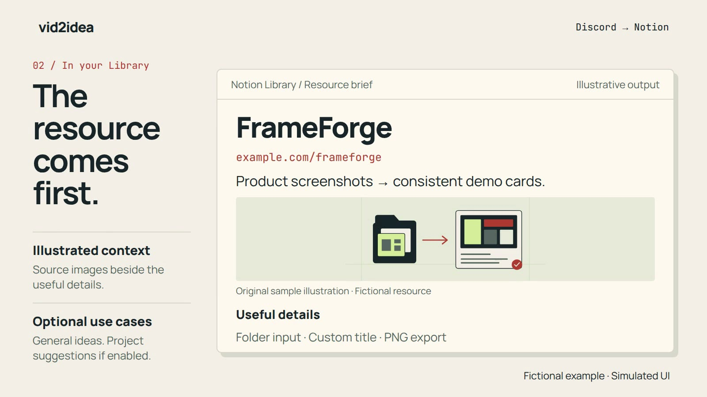

# A saved link, revisited

**[Open the 22-second demo](assets/vid2idea-demo.mp4)** · [Animated preview](assets/vid2idea-preview.gif) · [Text sample](../examples/brief.md) · [Installation](../README.md#get-started)

This silent walkthrough uses **fictional FrameForge content and simulated Discord and Notion views**. It shows the intended flow, with processing time condensed. It is not a recording of a live ingestion run or a speed benchmark. All source illustrations are original example artwork; the addresses use reserved `example.com` URLs.

## Walkthrough in words

| Time | What the demo shows |
| --- | --- |
| 0–4 seconds | A link shared in an ideas channel is retained for processing. |
| 4–9 seconds | The local queue feeds audio, on-screen text and sampled-frame analysis. Research is a separate pass that retains successfully opened sources. |
| 9–18 seconds | A Notion brief leads with FrameForge's name, address and summary, followed by an illustration, useful details and optional use cases. Its batch-mode research question remains inconclusive in this example. |
| 18–22 seconds | The original link and its brief stay connected, ready to revisit. |

Actual sources may be partially accessible or blocked, and sampled frames can miss details. A completed brief keeps coverage notes and unresolved questions visible. Your computer must be awake to process a source; Notion remains the reading interface afterward.

## What this demonstrates

The public project combines multimedia extraction, structured resource identification, optional project context, bounded research and native Notion publishing. Its local outbox and publication journal support recovery, while its managed content section preserves the reader's edits.

The demo is a visual explanation of those choices. For implementation details, see [architecture](architecture.md); for running and recovering the collector, see [operations](operations.md).

The visuals were planned with [Brag](https://github.com/latent-spaces/brag) and rendered locally with [Hyperframes](https://github.com/heygen-com/hyperframes). [Media source and regeneration instructions](media/README.md) are included for contributors. Creating these assets is optional and is separate from installing the collector.
